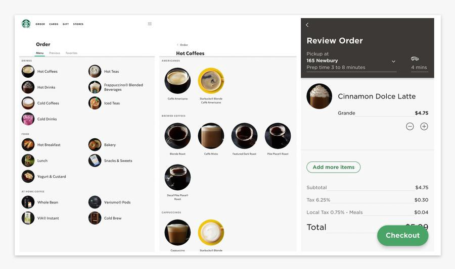
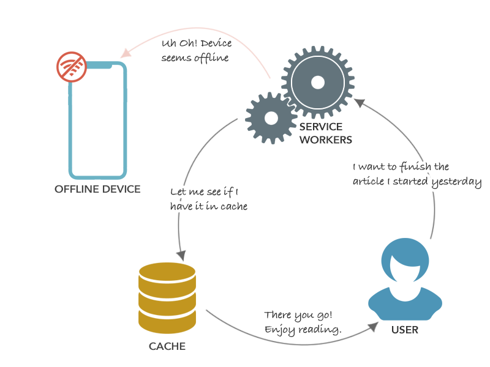

## Why Progressive Web Applications Are The Future

The web has evolved tremendously over the years. The web’s ability to be linkable makes it possible to search and share what you find with anyone, anywhere, on any device. A progressive web application takes the best of the web and mobile applications and combines them to make it feel like a native app with minimal page refreshes. An example of this is the Starbucks web app, which delivers a similar experience to their existing native app’s ordering system. The Starbucks PWA allows customers to browse their menu, customize their orders, and add items to their cart. Like most PWAs, all of this is achieved without consistent access to the internet. Once online, the customers can view pricing based on location and place their food and drinks order.

Speed is a critical factor in achieving the best user experience possible. High performing sites have the highest user engagement and retainment. A responsive Progressive Web App should feel fast and dependable regardless of network connection. There should also be little to no compromise in the user experience with a progressive web app compared to a traditional web app, although you may have to decide which functionality of your app to support online and offline.

Recent advancement in technology has allowed web apps to become installable to home screens, receive push notifications, and even work offline similar to a native app. How does this all work? You might ask. According to an article from smashing-magazine, modern web apps are based on a new technology called service workers. Service workers are programmable proxies that sit between the user’s tab and the internet. They intercept and rewrite network requests to allow caching and offline support. The service worker’s function is to simplify the process of bringing an app offline. It also lays the foundation for app-like features, such as push notifications. You make a service worker by registering it. This registration is done by another page or script on your website. When you register a service worker, you can instruct it to handle stuff for part of your site or the whole site. Another important piece to a progressive web app is a web manifest, which is a JSON file that provides basic metadata about the app. With a web manifest, it is possible to run the app in full-screen mode as a standalone app, to assign an icon that will get displayed when the application is installed on a device, and to assign a theme and background color to the app.

The characteristics of a progressive web app according to an article from web.dev is that it must work on all devices, responsive to any screen size because users may use your app at a range of device sizes, provides a custom offline page, is installable since users who install your apps are your most engaged audience, provides an offline experience so that when a user navigates to the url it makes the experience feel more native, and can be discovered through search by making sure that search engines can index your site which is critical for users to be able to find your PWA. In fact, certain browsers like chrome use some of these definitions to trigger an install prompt in the browser when a number of these conditions are met.

In conclusion, PWAs are powerful, effective, fast, and app-like. If more developers decide to take advantage of the features offered by progressive web apps, it can potentially eliminate the need for native apps that exist today. Hopefully, I’ve convinced you to start integrating these technologies into your ecosystem. If you like an in-depth dive into the world of progressive web apps, most of my explanations come from these two great articles from [smashing-magazines](https://www.smashingmagazine.com/2016/02/making-a-service-worker/) and [web.dev](https://web.dev/pwa-checklist/).